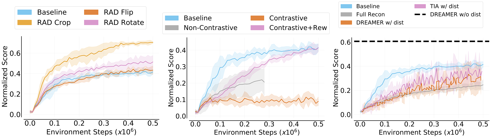

# Learning Representations in Reinforcement Learning on Pixel-Based Observations with Distractors

**Authors**: [Utkarsh A. Mishra](https://utkarshmishra04.github.io) and [Manan Tomar](https://manantomar.github.io)

**Description**:

This repository is a collection of widely used self-supervised auxiliary losses used for learning representations in reinforcement learning. Learning representations for pixel-based control has gained significant attention recently in reinforcement learning. A wide range of methods have been proposed to enable efficient learning. Such methods can be broadly classsified into few categories based on the auxiliary loss used, namely, with State metric ([DBC](https://github.com/facebookresearch/deep_bisim4control)), Reconstruction ([DREAMER](https://github.com/google-research/dreamer), [TIA](https://github.com/kyonofx/tia)), Contrastive ([CURL](https://github.com/MishaLaskin/curl)) and Non-Contrastives ([SPR](https://github.com/mila-iqia/spr)) losses. 


The approach in the repository uses a baseline architecture as shown in figure above (left) which is a very simple arrangement of reward and transition prediction modules in addition to the SAC Actor-Critic losses. There are 8 different experiments performed on a particular type of environment data named as the following cases:

- Case 0: Baseline only SAC, no reward and transition losses
- Case 1: Baseline, Reward through Transition
- Case 2: Baseline with only Transition loss
- Case 3: Baseline with only Reward loss
- Case 4: Baseline, Independent Reward and Transition
- Case 5: Baseline + Value Aware loss 
- Case 6: Baseline + Reconstruction loss (based on [DREAMER](https://github.com/google-research/dreamer))
- Case 7: Baseline + Contrastive loss (based on [CURL](https://github.com/MishaLaskin/curl))
- Case 8: Baseline + Non-Contrastive loss (similar to [SPR](https://github.com/mila-iqia/spr) which does this for Atari)

All the above experiments were further performed on 4 different environment data:

- Type 1: Simple Pixel [DM-Control](https://github.com/deepmind/dm_control)
- Type 2: Pixel DM-Control with [Natural Driving Distrators](https://github.com/Showmax/kinetics-downloader) (Figure above - right-top)
- Type 3: Pixel DM-Control + Natural Driving Distrators + Camera position and zoom offsets (Figure above - right-bottom)
- Type 4: Augmented Pixel DM-Control + Natural Driving Distrators




## Usage:

In order to use the repository, please install the requirements with `Python 3.6`.
```
python3 -m pip install -r requirements.txt
```

### Running the Cases

An example of a base script is already provided in `scripts/run.sh` where the order of arguments are case number, horizon length, domain and task of DM-Control suite. The complete script for cheetah-run (from DMC), case-number (from 0 to 8 as above) and horizon 1 is as follows:

```
CUDA_VISIBLE_DEVICES=0 python train.py \
    --domain_name cheetah \
    --task_name run --case 1 \
    --encoder_type pixel --work_dir ./tmp/test \
    --action_repeat 4 --num_eval_episodes 10 \
    --pre_transform_image_size 100 --image_size 84 --replay_buffer_capacity 100 \
    --frame_stack 3 --seed 1 --critic_lr 1e-3 --actor_lr 1e-3 --eval_freq 10000 \
    --batch_size 16 --num_train_steps 160000 \
    --init_steps 1000 --horizon 1
```

### Running the natural video setting

You can download the Kinetics 400 dataset and grab the driving_car label from the train dataset to replicate our setup. Some instructions for downloading the dataset can be found here: [https://github.com/Showmax/kinetics-downloader](https://github.com/Showmax/kinetics-downloader). Here, one downloaded video is provided in `'./distractors/driving/` folder. The following flag can be used to incorporate the distractor settings:

```
    --resource_files './distractors/driving/*.mp4' --img_source 'video' --total_frames 50
```

For more information, refer [DBC](https://github.com/facebookresearch/deep_bisim4control) codebase.

### Offsets in Camera position and Zoom

The offset data can be activated by using the `--off_center` flag when the DM-Control suite is changed from `./local_dm_control_suite/` to `./local_dm_control_suite_off_center/`. The observations for each of the modified environment can be found in the `./local_dm_control_suite_off_center/{env}.xml` file under the `<camera name="cam0">` tag.

### Data Augmentations

Augmentations can be specified through the `--data_augs` flag. This codebase supports the augmentations specified in data_augs.py and taken from [RAD](https://github.com/MishaLaskin/rad) codebase. To chain multiple data augmentation simply separate the augmentation strings with a - string. For example to apply crop -> rotate -> flip you can do the following `--data_augs crop-rotate-flip`.

### Logging

To save the trained model, the tensorboard logs, video of evaluation episodes and the replay buffer, the following flags can be used respectively:

```
    --save_model \
    --save_tb \
    --save_video \
    --save_buffer \
```


## Citation:

If you find this useful you can cite this work as follows:

```


@misc{representation-learning-pixels,
  author = {Mishra, Utkarsh A. and Tomar, Manan},
  title = {Learning Representation in Reinforcement Learning on Pixel-Based Observations with Distractors},
  year = {2021},
  publisher = {GitHub},
  journal = {GitHub repository},
  url = {https://github.com/UtkarshMishra04/pixel-representations-RL}
}
```

## Acknowledgement:

We thank the authors of [RAD](https://github.com/MishaLaskin/rad), [CURL](https://github.com/MishaLaskin/curl) and [SPR](https://github.com/mila-iqia/spr) for their well-structured open source code.
