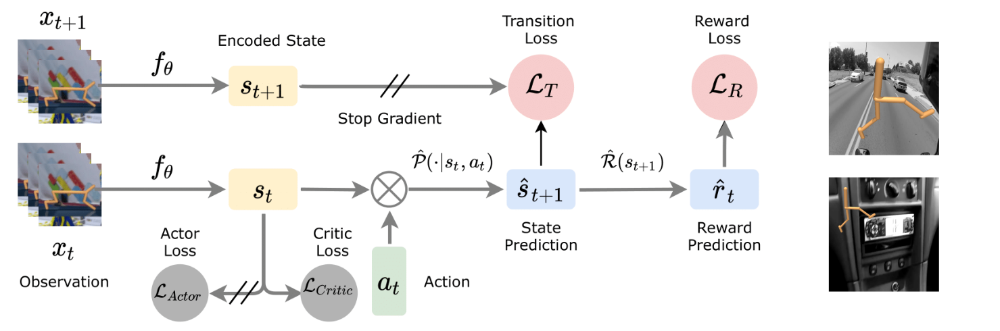

# Learning Representation in Reinforcement Learning on Pixel-Based Observations with Distractors

**Authors**: [Utkarsh A. Mishra](https://utkarshmishra04.github.io) and [Manan Tomar](https://manantomar.github.io)

**Description**:





## Usage:


## Citation:

If you find this useful you can cite this work as follows:

```
@misc{representation-learning-pixels,
  author = {Mishra, Utkarsh A. and Tomar, Manan},
  title = {Learning Representation in Reinforcement Learning on Pixel-Based Observations with Distractors},
  year = {2021},
  publisher = {GitHub},
  journal = {GitHub repository},
  url = {https://github.com/UtkarshMishra04/representation_learning_pixels}
}
```

## Acknowledgement:

We thank the authors of [RAD](https://github.com/MishaLaskin/rad), [CURL](https://github.com/MishaLaskin/curl) and [SPR](https://github.com/mila-iqia/spr) for their well-structured open source code.